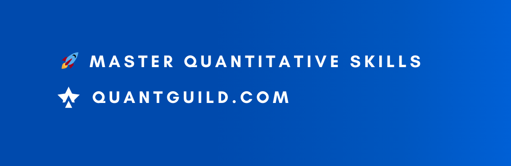

## 🚀 Master Quantitative Skills with <a href="https://www.quantguild.com">Quant Guild</a>
Rank up your quantitative skills on Quant Guild by practicing math, probability, computer science, and finance questions designed to give you the background you need to pursue a career as a quant.

#### 🌱 Links
<html>
<head>
    <meta charset="UTF-8">
    <meta name="viewport" content="width=device-width, initial-scale=1.0">
</head>
  <body>
             <ul>
                <a href="https://www.youtube.com/@QuantGuild" target="_blank"><li><i class="fab fa-youtube"></i> YouTube</li></a>
                <a href="https://www.tiktok.com/@quantguild" target="_blank"><li><i class="fab fa-tiktok"></i> Tik Tok</li></a>
                <a href="https://www.instagram.com/quantguild/" target="_blank"><li><i class="fab fa-instagram"></i> Instagram</li></a>
                <a href="https://www.linkedin.com/company/quant-guild" target="_blank"><li><i class="fab fa-linkedin"></i> LinkedIn</li></a>
                <a href="https://romanmichaelpaolucci.medium.com" target="_blank"><li><i class="fab fa-medium"></i> Medium</li></a>
                <a href="https://github.com/romanmichaelpaolucci" target="_blank"><li><i class="fab fa-github"></i> GitHub</li></a>
                <a href="https://discord.com/invite/MJ4FU2c6c3" target="_blank"><li><i class="fab fa-discord"></i> Discord</li></a>
            </ul>
    </body>
</html>

## 📫 Contact Info 📫
- support [at] quantguild [dot] com
- roman [dot] paolucci [at] columbia [dot] edu

<!--
**romanmichaelpaolucci/RomanMichaelPaolucci** is a ✨ _special_ ✨ repository because its `README.md` (this file) appears on your GitHub profile.

Here are some ideas to get you started:

- 🔭 I’m currently working on ...
- 🌱 I’m currently learning ...
- 👯 I’m looking to collaborate on ...
- 🤔 I’m looking for help with ...
- 💬 Ask me about ...
- 📫 How to reach me: ...
- 😄 Pronouns: ...
- ⚡ Fun fact: ...
-->
