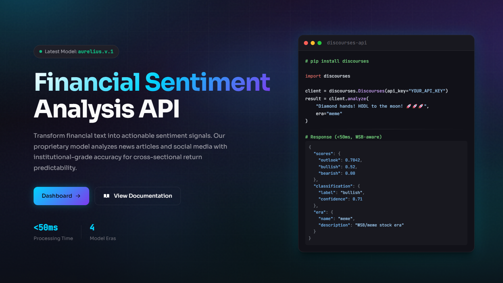

# 👋 I'm Roman, Founder of Quant Guild, CEO of discourses.io

## 🌀 discourses.io | Where Markets are Discussed

A financial social media app and data product leveraging academic and professional quantitative research

[discourses.io](https://discourses.io)

## 🚀 Master Quantitative Skills with Quant Guild

I built **Quant Guild** from scratch to help aspiring quants learn the necessary skills. 

[Quant Guild Platform](https://quantguild.com)

---

## 📚 Lecture Video Library

I quite enjoy lecturing about quantitative topics!  

I have 100+ lecture videos available from randomized numerical linear algebra to the simulation of fractional Brownian motion.

[YouTube Channel](https://youtube.com/@QuantGuild)

I've also created a repo containing all of the relevant resources for each video lecture.

[Jupyter Notebook Library](https://github.com/romanmichaelpaolucci/Quant-Guild-Library)

---

## 🐍 Python Libraries

**Python Packages:**
* **[discourses](https://github.com/romanmichaelpaolucci/discourses)**: (A Python SDK for [discourses.io](https://discourses.io)) 
* **[Q-Fin](https://github.com/romanmichaelpaolucci/Q-Fin)**: (A working Python library for mathematical finance. *Deployed, in development*)
* **[Gaussian Cookbook](https://github.com/romanmichaelpaolucci/GaussianCookbook)**: (A series of notes (articles) and an open-source Python library for simulating stochastic processes.  *Not Deployed, in development*)

---

## 💎 Artifacts

**Websites:**
* **[Gaussian Cookbook](https://gaussiancookbook.com)** (Recipes for simulating stochastic processes by Chef Roman Paolucci.)
* **[Practice Market Making](https://practicemarketmaking.com)**: (A statistical market-making game where the player may act as the market maker or participant.)
* **[Byte Potion](https://bytepotion.com)**: (A suite of finance apps for quantitative research.)

---

## 📫 Connect with Me

**Socials:**
* **discourses.io** [@quantguild](https://discourses.io/u/quantguild)
* **Instagram:** [@quantguild](https://www.instagram.com/quantguild)
* **TikTok:** [@quantguild](https://www.tiktok.com/@quantguild)
* **Medium:** [@quantguild](https://medium.com/@quantguild)
* **X (Twitter):** [@quantguild](https://x.com/quantguild)
* **LinkedIn (Personal):** [rmp99](https://www.linkedin.com/in/rmp99/)
* **LinkedIn (Company):**[@quantguild](https://www.linkedin.com/company/quant-guild)

*To inquire about a seminar for your student group or organization please reach out to the following email:*
- 📩 support [at] quantguild [dot] com

---

