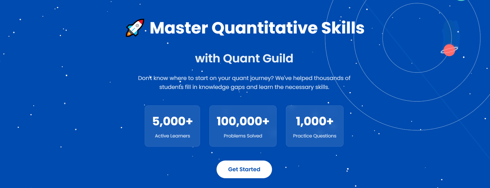

# Roman Paolucci | Quant Guild Founder & Educator

## 🚀 Master Quantitative Skills with Quant Guild

I built **Quant Guild** 

[Explore Quant Guild](https://quantguild.com)

---

## 📚 Roman's Lecture Video Library

Enhance your learning with our comprehensive video lectures, directly linked to practical examples.

[Access the Lecture Videos](https://github.com/romanmichaelpaolucci/Quant-Guild-Library)

---

## 📫 Connect with Me

- **Support:** support [at] quantguild [dot] com
- **Personal:** roman [dot] paolucci [at] columbia [dot] edu

---

## 💡 My Ventures

I'm also the proud owner of:

* [Byte Potion](https://bytepotion.com)
* [Practice Market Making](https://practicemarketmaking.com)
* [Gaussian Cookbook](https://gaussiancookbook.com)
